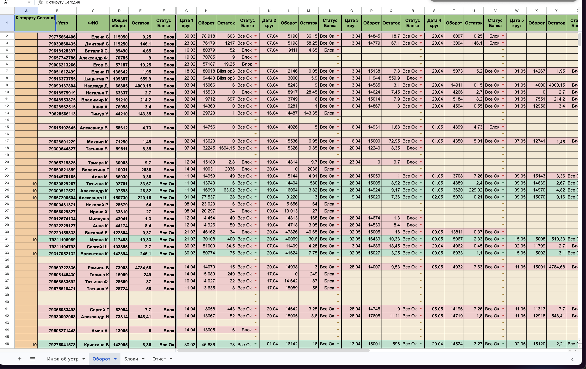

## Тимлид 

### 1) вкладка Аналитика:
- выводить оборот за сегодня + за период
- на аналитеке разделить таблички входы выходы табами + табличка для выходов
- аналитику входы/выходы визуально сделать рядом на одной строке
разделить визуально на два столбца
- убрать Последние импорты
- алерт Расхождение вывести повыше

### 2) вкладка Реквизиты:
- задается только номер телефона
- не надо выводить метод (он будет метчится только в выписках)
- проверка на дубли реков (прокси + телефон)
- добавляем мультиселект для банков
- комментария для сотрудника для номер+банк 
- быстрый редактор коммента через карандаш как на морелогин
- надо чтобы прорастали ФИО и номер карты в рек (задает трейдер) - делается один раз, когда трейдер первый раз заносит инфу

уловие валидации (на бэке) с выводом ошибки на фронте
- на каждый номер+банк уникальный проки
- прокси уникальный глобально

фиксы:
- починить переключение трейдра (сейчас 500)

фичи:
- нужен функционал предпланирования: тимлид может на завтра назначить реки, с которыми трейдеры будут работать (можно сделать отдельным табом)
тимлид при предпланировнии река должен задать "Целевой оборот" - это лимит трейдеру, который он должен достигнуть, но не перевыполонять

### 3) вкладка Сотрудники
- пароль руками задается

### 4) вкладки Инвойсы и Выплаты можно схлопнуть
в целом таблица ордеров вообще не нужна

### 5) Сверка (вкладка Период, надо переименовать)

#### 5.1) Выплаты
- расхождение фиксируем по ордерам из выписки и ручные ордеры трейдера, проверяем каждый ордер 
тут расхождение можно увидеть по ордеру, потому что есть ручные выплаты
- это работает у трейдера

#### 5.2) Инвойсы
- расхождение фиксируем по обороту который вводит трейдер по реквизиту.
ВАЖНО: трейдер вносит временный оборот по реку - вот по нему надо искать расхождение

ФИКС: трейдер фиксирует руками оборот по реку, который отработал - это не промежуточный оборот. После того как он зафиксил оборот рек освобождается.

Нужны статусы когда рек отработан в течении дня:
- рек создан (без ФИО и карты) - тимлид создает
- рек готов к работе - трейдер заполняет ФИО/карту
- рек отработан - после фиксации оборота трейдером
- (*) коррекция - если после отработки и сверки оборот расходится
- рек готов к работе
- (*) рек в блоке - финальный необратимый статус (задает трейдер)
при занесении оборота можно пометить блок река.

### 6) вкладка Отчет по реквизиту

нужна табличка, где видно реки с инфой:
Ось Y (это должно быть все в списке реков)
- реки телефон (ФИО, номер карты, телефон - по наведению показывать с возможностью копирования карты и телефона)
- суммарный оборот - должен храниться на бэке и аггрегироваться.
- остаток последний - должен обновляться после обновления трейдера
- статус последний

Отчет по рекам (из excel, )
Ось X - смены/дни в которые рек был активен (это должно выводиться при открытии отчета, надо в списке сделать кнопку "отч")
- статус смены
- оборот на вход по смене (при наведении можно вывести кто обработал)
- оборот на выход по смене
- лимит на эту смену
- остаток на конец смены (вводит трейдер в конце смены)

ФИЧА:
Аналитика по заблокированному реку (делаем диаграммой):
можно увидеть в разрезе смен по оси X в какие дни работал рек с инфой:
- сумма оборота (вход)
- трейдер

## Трейдер

#### 1. Реквизиты

Когда рек "Готов к работе", то трейдер может взять рек в работу после чего отображатся ФИО и номер карты

ФИЧА: Сдача реквизита: оборот фиксируется по факту отработки реквизита
- суммарный оборот по входам за смену (сравниаем CSV с ручным оборотом)
- суммарный оборот по выплатам за смену (тут сравниется сумма с оборотом ручными выплатами / можно еще сравнивать с оборотом из CSV)
- (*) блок - чекбокс
- остаток

Таблица:
- отображаем целевой оборот (его нельзя перевыполнять - это должен контролить трейдер)
если целевой оборот превышен - это плохо для банка (по мануалу может в блок улететь)

#### 2. История работы (активность)
видны смены, какие реки были в работе с инфой:
- дата
- рек
- оборот
- остаток
- выставленный статус
- целевой оборот

#### 3. Ручные выплаты 
- при выплате есть комиссия банка, ее нужно учитывать в P&L
- пока что не учитываем в сверке

